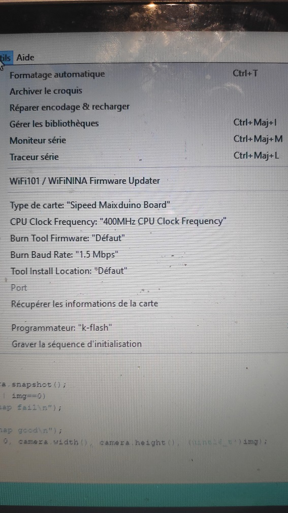

# Dirigeable
Cette partie du git est réservé aux documents de développement du dirigeable.

## Maixduino
Voici une photo montrant la configuration IDE Arduino : 

## Programme
Voici la liste des progammes conçu pour le dirigeable:
- [Selfie](programme/selfie) : Programme permettant d'afficher le flux video de la camera sur l'écran.
- [main_firmware](programme/main_firmware) : Programme permettant d'effectuer la reconnaisse IA depuis la camera.
(Nécessite le modelè [m.kmodel](m.kmodel), il doit etre renomer en "m" et mis sur une SD)
