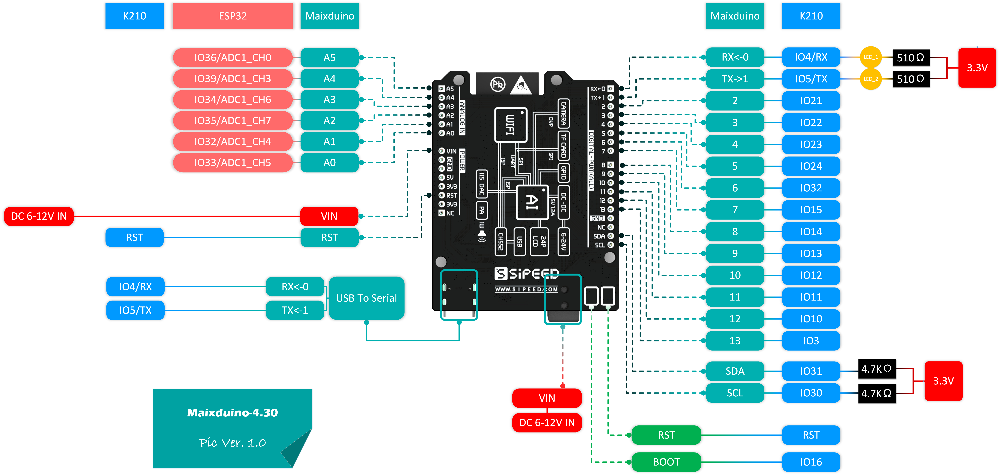

# Dirigeable
Cette partie du git est réservé aux documents de développement du dirigeable.

## Maixduino
Voici une photo montrant la configuration IDE Arduino : 
Voici la configuration des pins : 

## Programme
Voici la liste des progammes conçu pour le dirigeable:
- [Selfie](programme/selfie) : Programme permettant d'afficher le flux video de la camera sur l'écran.
- [main_firmware](programme/main_firmware) : Programme permettant d'effectuer la reconnaisse IA depuis la camera.
(Nécessite le modelè [m.kmodel](mobilenet_model/m.kmodel), il doit etre renomer en "m" et mis sur une SD) (OBSOLETE)
- [yolo_firmware](programme/yolo_firmware) : Programme permettant d'effectuer la reconnaisse IA depuis la camera.
(Le modèle [YOLO](yolo2_model/) est directement intégré dans le micrologiciel)
- [Controle_du_drone](controle_drone_firmware) : Programme pour controller les moteurs du drones.
- [arduino_i2c_slave](arduino_i2c_slave) : Programme I2C esclave.
- [ble_decode](ble_decode) : Programme de décodage des commandes bluetooth.
- [i2c_com](i2c_com) : Programme de la Maixduino pour communication "binaire".