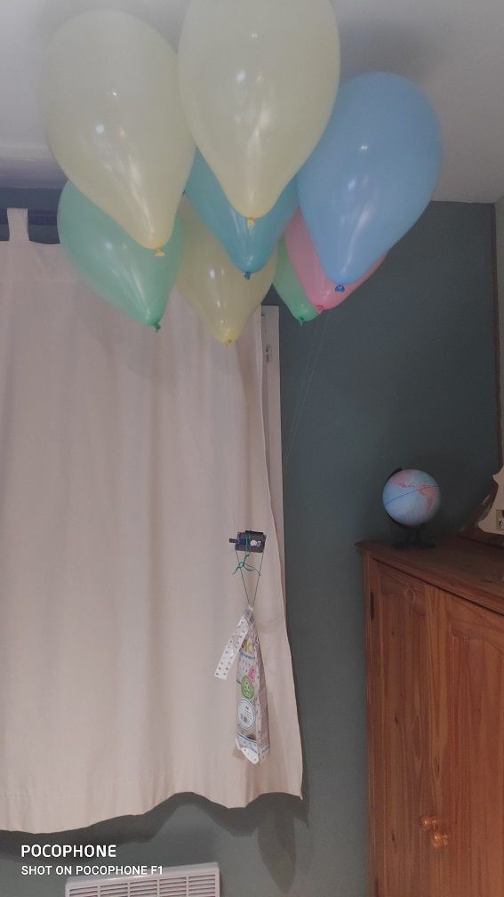
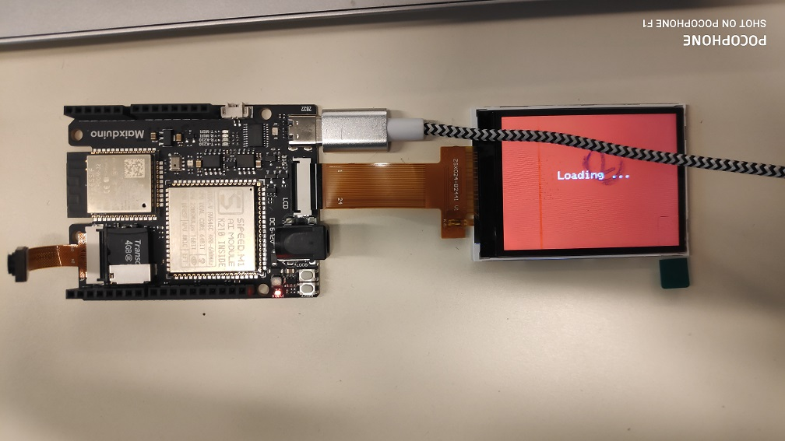
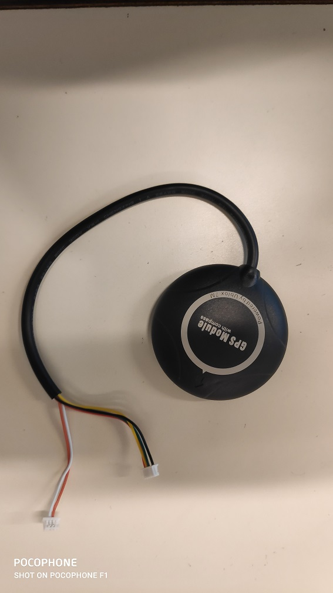

# Rapport de séance 1 du 01/12
Lors de cette séance, j'ai recu le matériel lié au projet.
La liste de ce matériel est disponible [ici](../../liste_materiels.md)

## Travail à la maison
Avant de commencer le rapport de la séance je vais rapporter ici le travail effectuer à la maison avant la première séance
Dans le but de concevoir un dirigeable capable de voler gràce à des ballons d'helium, un premier prototype a été construit.
Il était constitué de ballons remplis d'helium attachés à une arduino. Divers problèmes ont été rencontrés :
- les premiers ballon gonflés n'ont atteint que environ 60% de leurs volumes maximum.
> Problème réglé en les gonflant plus longtemps.
- les premiers serrages de ballon étaient insuffisant, l'helium s'échappait trop rapidement.
> Problème réglé en modifiant le serrage.
- il fallut plusieurs essaies de ficelle pour trouver la plus fine, la plus lègère et la plus résistante.
- il fallut trouver la bonne configuration pour l'équilibrage
- un problème c'est posé sur le temps de vol, d'après l'expérience les ballons n'ont volés que quelques heures.
> Problème non résolu.

## Travail de la séance

L'objectif de la séance était de réaliser la détection des personnes et véhicules par l'IA.

### Réalisation de la détection

Après avoir récuperer l'Arduino spécial IA que je nommerais la Maixduino. J'ai commencé par configuré l'IDE Arduino
afin qu'il reconnaisse cette nouvelle carte. Je suis ensuite allé chercher le code d'exemple permettant d'effectuer la reconnaissance
sur le site suivant [link](https://github.com/sipeed/Maixduino/tree/master/libraries/Maix_KPU/examples/mobilenet_v1).
Dans le même temps j'ai téléchargé le modèle(le fichier qui dit comment faire la reconnaissance) sur une carte SD que j'ai ensuite
inséré dans la Maixduino. J'ai ensuite branché l'écran LCD qui devait faire le retour vidéo.
> Problème : la Maixduino nécéssite une connectique USB-C que je n'avais pas.
Afin de ne pas rester coincé et de perdre du temps je suis passé sur la compréhension du module GPS qui sera détaillé
dans la section suivante.

Après avoir recu le cable j'ai téléversé le programme.
> Problème : aucun téléversement.

Les recherches ont montrés que le problème venait d'une erreur de configuration de l'IDE rapidement réglé.
> Problème : l'écran LCD était noir et le moniteur serie indiquais un message d'erreur.

Pour l'écran l'erreur venait d'une mauvais branchement sans conséquence pour le matériel. Pour le message d'erreur du moniteur série,
cela a été plus compliqué. Il a fallu analyser le code. Ce-dernier montrais que la caméra utilisée était une OVH2460 or celle 
fourni avec la Maixduino est une GC0328. Il a donc fallu téléchargé une librairie approprié (facilité par le récurrence
de ce problème sur le github de la Maixduino) et modifié le code de l'exemple afin de remplacer le nom de la camére.
Après ces problèmes résolus, le programme a démarré comme montre l'image suivante :

Je n'ai pas d'image du fonctionnement de l'IA car le modèle est long à charger et qu'à cause du soucis de USB-C, il était
la fin du temps imparti. Des précisions seront apportées dans le prochain rapport.

Voici un lien vers les codes : [link](../../Dirigeable/README.md)

### Compréhension du GPS

Dans l'attente de l'USB-C, je me suis penché sur un autre aspect du dirigeable qui est le pilotage GPS. Pour cela j'ai
obtenu un module GPS qui contenait également un compass (circuit permettant d'obtenir la direction magnétique).

> Problème : le modèle possède six câbles sans aucune indication.

Des recherches ont été effectués, et on permis de montrer que les 4 câbles permettait d'alimenter les modules et d'avoir
une liaison série avec le module GPS et les 2 câbles permettait d'avoir une liaison I2C avec le module compass.
Cela a permis d'alimenter une premier fois le module afin de voir s'il fonctionnait. Les recherches ont aussi permis de trouver la librairie
pour le compass, son modèle est HMC5883L, et le [site](https://electroniqueamateur.blogspot.com/2019/06/fabrication-dune-boussole-avec-le.html) suivant indique un code pour le tester.
En ce qui concerne le module GPS, sa liaison série envoie les données en permanence, il reste à trouver une librairie pour les décoder.