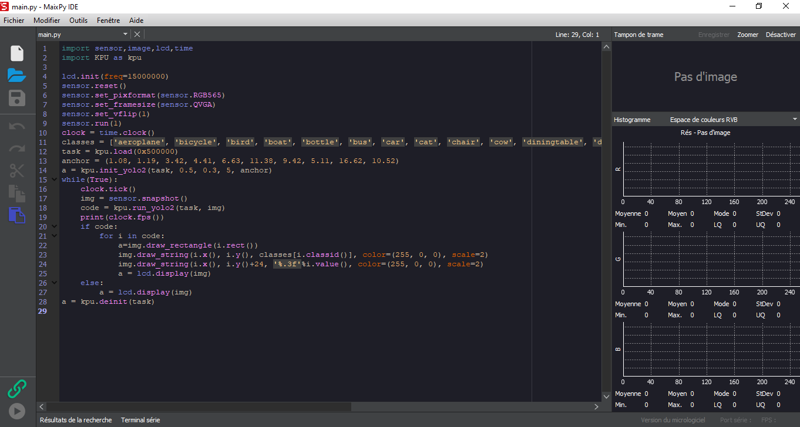
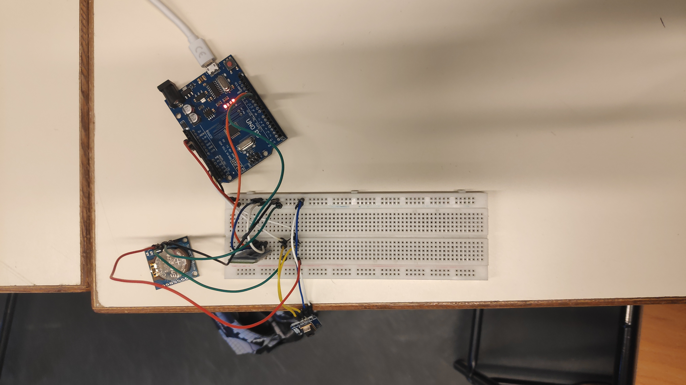
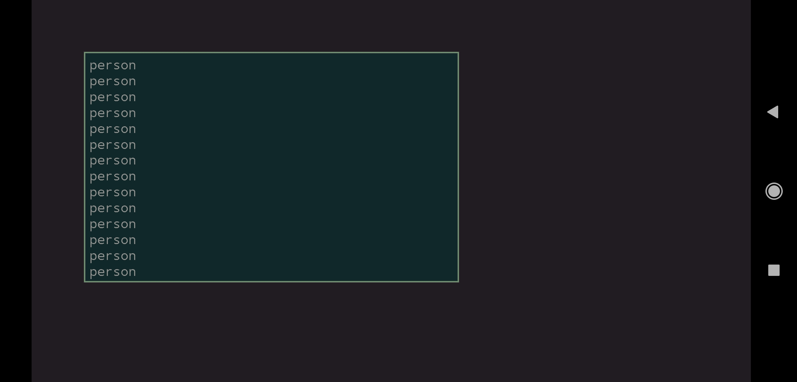

# Rapport de séance 3 du 05/01
Lors de cette séance j'ai pu tester en condition réelle, la reconnaissance par IA. 
J'ai également fait réparer le module permettant de récupérer l'heure. J'ai aussi tester
le module bluetooth. J'ai ensuite utiliser le capteur thermique pour détecter le passage
d'une personne. Enfin j'ai commencer la calibration du radar doppler.
Voici le lien vers les codes: [link](../../Boitiers/README.md)

## Reconnaissance IA

Grâce au travail effectuer lors des vacances, la maixduino, reconnait maintenant les objects 
et les humains comme on peut le voir sur l'image ci-après:

On voit un premier plan un camarade qui est reconnu en tant que "person" ainsi que deux autres
dans le fond à gauche.
Afin de réaliser cela le langage de programmation a été changé nous sommes passé du C-Object à python.
En effet il existe une version du firmware (le micrologiciel qui gère la maixduino) qui accepte le
"live-python", c'est à dire que nous codons en python dans un ide et nous pouvons l'envoyer sur l'arduino
et voir le retour de l'ecran LCD sur le logiciel.
Comme on peut le voir ci-dessous (dans le cadre marquer "Pas d'image")

Quand le programme fut finaliser, on peut l'inscrire dans le firmware, ainsi que le fichier
qui sert de modèle à l'IA, comme cela le code python le charge à partir d'une adresse 
mémoire, ce qui est plus rapide.

## Module Timer

Lors d'une nouvelle tentative afin de faire fonctionner le module permettant de retenir la date et l'heure
en mémoire, le module c'est trouvé être défectueux, il lui manquais une soudure permettant son alimentation
par la pile lorsque l'Arduino est éteinte. Après un nouveau test la date et l'heure ne sont toujours pas retenu.
On peut donc supposer un problème de pile. Je testerai chez moi avec une nouvelle pile.

## Module Bluetooth

Dans l'optique de pouvoir savoir si une personne passe devant un capteur sans devoir être devant l'écran de
l'ordinateur, ainsi que pouvoir commander l'exctinction et l'allumage j'ai voulu teste le module bluetooth,
ainsi que l'application sur portable. Après mise sous tension et programmation j'ai reussi à faire envoyer
un message du portable à l'arduino, ainsi que inversement.

## Camera Thermique 

J'ai voulu commencer à entrer dans le vif su sujet, et la détection des personnes. Pour cela j'ai combiner
le programme du timer, du bluetooth et de la caméra thermique. Cette derniere pointe sur son environnement.

L'algorithme analyse la différence de température globale entre deux prises. Et au dessus d'un certain seuil
il envoie un message à travers le bluetooth au portable en disant qu'il y a une personne.

Cette technique sera combinée avec le Doppler afin d'affiner la détection.

## Radar Doppler

Enfin, le Doppler a également été sorti afin de la calibrer et de le tester en environnement réel.
Il s'avère qu'il est compliqué au départ de comprendre qu'est ce qui dans la salle le fait clignoter.
Le programme ou la communication Arduino-PC plante aussi de temps en temps rendant compliqué la compréhension.
L'objectif suivant est donc de baisser la porter du radar avec un tournevis (sur le potentiomètre) avant de petit
à petit la monter afin de maitriser la zone de détection.

## Boitier

Objectif pour la semaine prochaine avoir un schema/plan du boitier qui va contenir le dispositif.