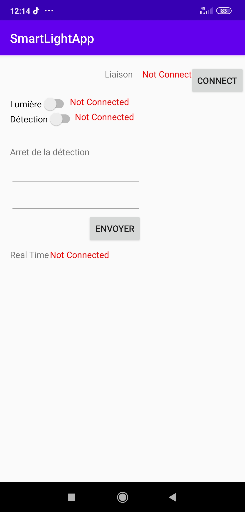
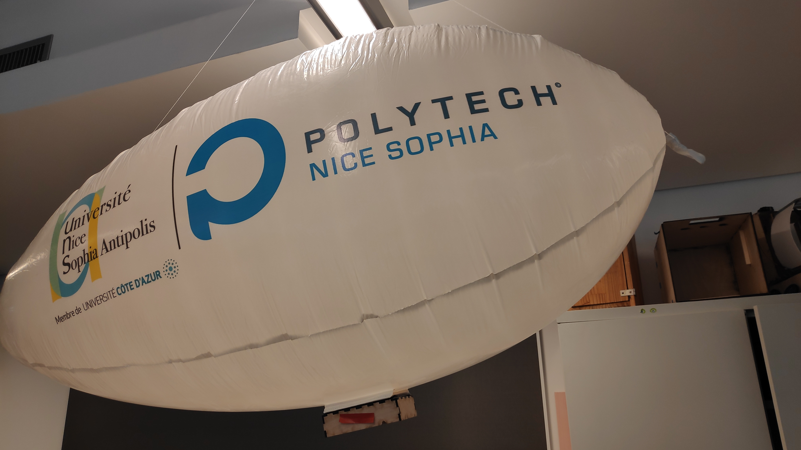
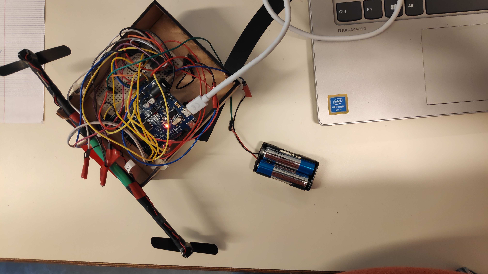
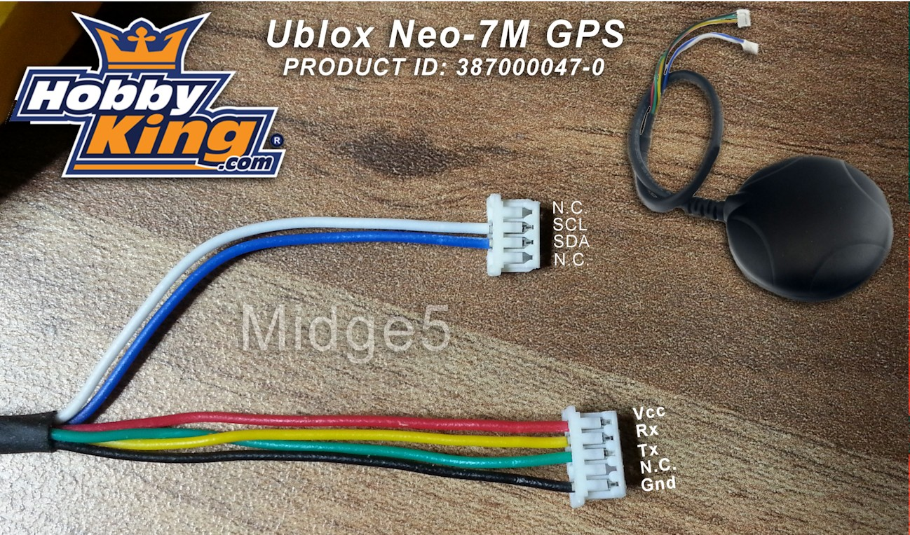

# Rapport de séance 5 du 31/01
Lors de cette séance j'ai testé l'application Android et la librairie C faites à la maison. Avec Monsieur Masson, nous avons gonflé
et accroché l'ancien dirigeable afin que je puisse effectuer des tests avec lui. J'ai mis en marche les moteurs et commencé à travailler
le GPS.

## Application Android

La semaine dernière, j'ai mis au point un application Android afin de communiquer avec le module Bluetooth. L'application donnée lors
du cours ne suffisait plus. Cette dernière peut se connecter au module Bluetooth et lui envoyer divers commandes complexes au format
clé=valeur;clé2=valeur2;. L'application sert à activer/désactiver le lampadaire, activer/désactiver le processus de détection.
L'application peut envoyer une date et une heure pour désactiver la détection. Et pour finir elle peut savoir si une personne ou
un véhicule a été détecté.
Voici une capture d'écran:

L'application sera enrichie prochainement afin de pouvoir controller le dirigeable.

## Librairie C

La semaine dernière, j'ai également mis au point des fonctions en C afin de pouvoir décoder les commandes complexes envoyées par
l'application. Ces dernière doivent être manipulées avec précaution car elle alloue de la mémoire donc en cas d'erreur, elles
peuvent corrompre la mémoire de la carte.
Voici le lien de la librairie avec un exemple : [ici](../../Boitiers/c_lib/split_lib.c)

## Dirigeable

Lors de cette séance, M.Masson et moi-même avons sorti le dirigeable de son carton. Il possédait de nombreuses déchirures.
Après les avoir réparer, M.Masson a gonflé le ballon jusqu'à qu'il prenne forme puis la accroché dans la salle, comme le montre
l'image ci-dessous. Ce dirigeable est temporaire, en attendant le nouveau.

Comme ce dernier est accroché, il n'y a pas de contrainte de poids.

### Boitier et moteurs

Ensuite j'ai aussi récupéré le boitier permettant de controller les 3 moteurs : 2 pour avancer et 1 pour monter. Nous pouvons
le voir sur l'image ci-contre : 
Les moteurs sont controllés par l'Arduino qui va recevoir ses ordres d'un module Bluetooth (ce dernier a été configuré).
Le programme de test des moteurs est fait (disponible [ici](../../Dirigeable/controle_drone_firmware/controle_drone_firmware.ino))
Il y a eu un problème d'alimentation avec les moteurs, en effet ces derniers tirés leurs énergies de la carte qui ne leurs
donnait que 400 millivolt. Je suis donc passé sur une alimentation par pile de 3V mais qui n'est toujours pas suffisante. Il faudra
tester une autre alimentation de 5V.

### GPS

Pour que le dirigeable puisse être piloté, il lui faut le module GPS. Grâce à l'image suivante et à M.Masson j'ai pu avoir
le câblage et la librairie TinyGPS++ qui me permet de récuperer les codes d'exemples. Lors du premier test, à l'extérieur
aucun signal n'a été reçu, il faudra réssayer.
