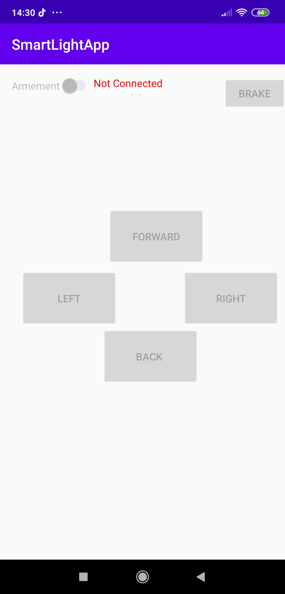
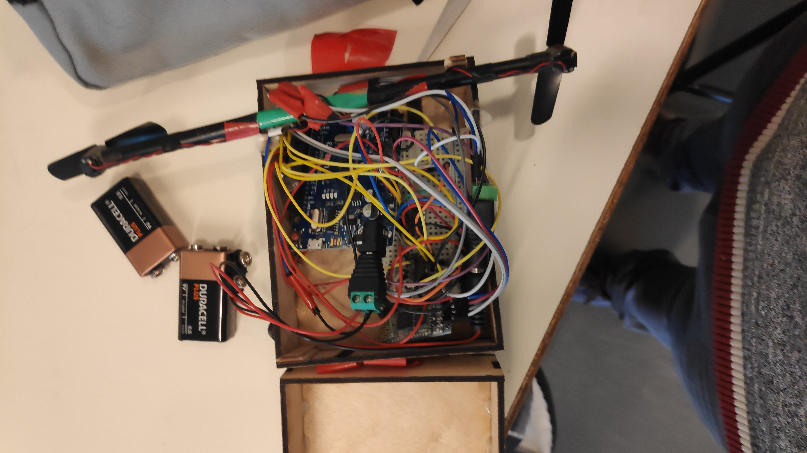
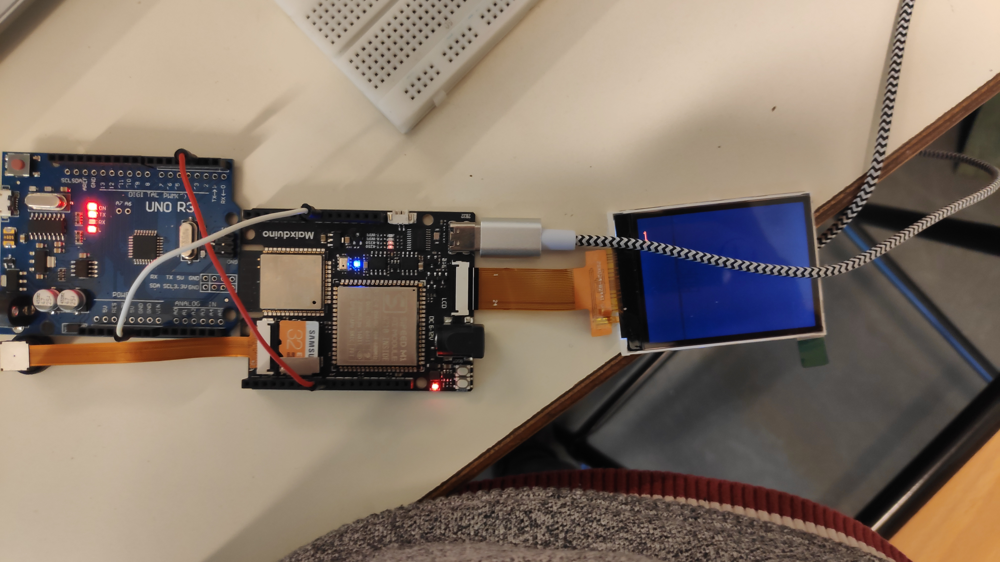

# Rapport de séance 6 du 07/02
Lors de cette séance, j'ai testé la nouvelle application Android, mis en marche les moteurs du dirigeable et relier par connexion filiaire
la Maixduino et l'Arduino Uno.

## Application Android

L'application Android a été mis à jours afin de répondre aux éxigence de commande du dirigeable. Pour cela une nouvelle page a été rajouté. Cette
dernière contient les boutons de commandes pour avancer, reculer, tourner à gauche, tourner à droite ou grimper. Il y a un boutton permettant
de stopper tous les moteurs. Tous ces dispositifs ne peuvent être activés que si le slide armement est allumé afin de s'assurer qu'il n'y
ai pas de pression parasite.
Voici la photo : 

## Boitier, moteurs et bluetooth

Pour cette séance l'objectif était que les moteurs puissent démarrer par eux-mêmes. Après avoir essayer un premier circuit d'alimentation
qui renvoyait du 5V après transformation d'une pile de 9V, les moteurs ne démarraient toujours pas par eux-même. Il a donc fallu brancher
directement la pile de 9V sur les moteurs afin que ces derniers démarrent par eux-mêmes.
Afin de décoder les ordres de l'application, j'ai voulu utiliser la librairie énoncée dans le rapport précédent. Sauf que l'Arduino rencontrait
des erreurs de mémoires, après test à part, il en vient que le programme utilise peut-être un modèle mémoire ordinateur. Mais comme les
commandes dans ce cas sont simples, j'ai opté pour un simple comparaison. Le problème de la librairie sera réglé plus tards.
Voici un lien vers les différents codes: [ici](../../Dirigeable/README.md) 
Voici également des photos et vidéos du dirigeable en fonctionnement ainsi que l'intérieur de la boite:

## Communication interne au dirigeable

Dans cette séance j'ai également posé les bases afin que la Maixduino la carte qui va servir à détecter les humains par vision et la carte
Arduino qui va communiquer par bluetooth à l'application.
Dans un premier temps une communication Serial a été envisagé mais difficile à mettre en place parce que la programmation se faisant
sur python la configuration des pins est très compliquées.
Ensuite un communication de type I2C a été envisagé, mais impossible à mettre en place car la Maixduino scan seulement certains périphériques
I2C sont reconnus.
Donc la derniere solution envisagée est la communication "binaire", c'est à dire qu'un premier fils est chargé de transmettre les requêtes
à la Maixduino et l'autre est chargé d'envoyer la réponse.
Le protocole qui doit être établir est le suivant : le fils 1 passe à 5V quand l'Arduino demande à la Maixduino si il y a quelqu'un
au bout de 5 secondes on lit la réponse sur le fils 2, si il est à 5V alors il y a quelqu'un.
La configuration des ports est compliqué car MaixPy support plusieurs cartes, donc à chaque début de programme, il faut indiquer les ports
utiliser et les nommers comme on peut le voir dans ce fichier : [ici](../../Dirigeable/i2c_com/i2c_com.py)
Et voici une image :

## Travail à réaliser à la maison

A la maison il faut que j'effectue les tâches : 
- Réparer la librairie interne
- Mise au point de la communication entre Arduino
- Coder completement le système du boitier au sol (mise en commun de tous les bouts)
- Dessiner les plans pour la boite au sol