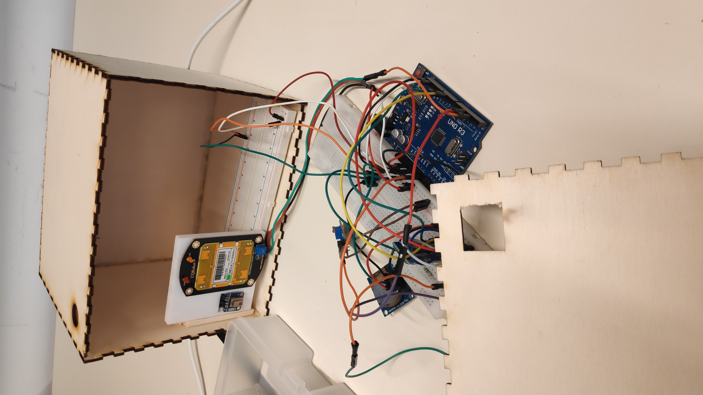
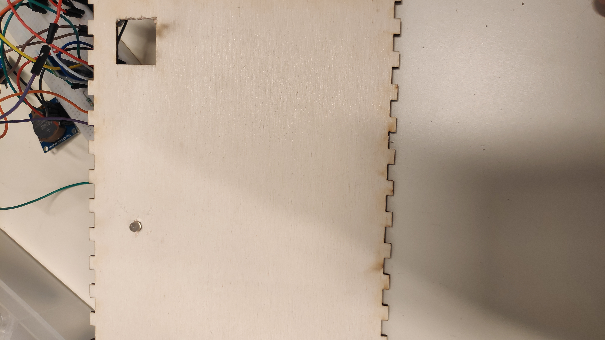
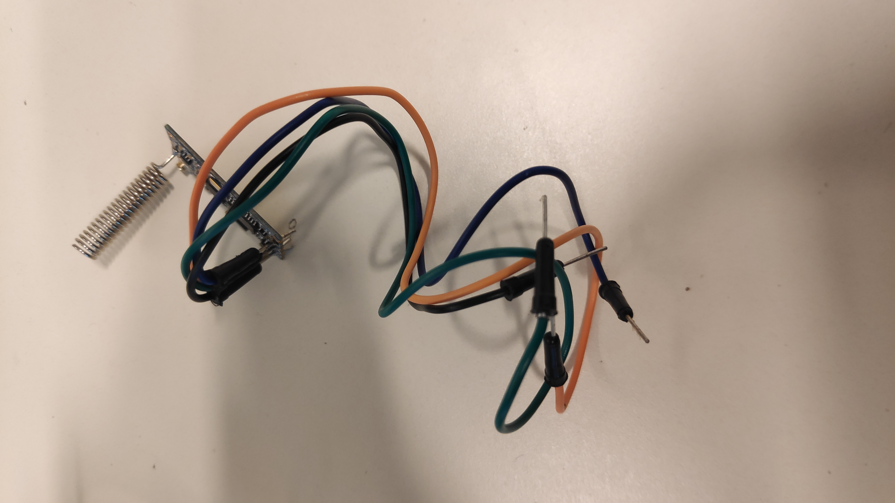

# Rapport de séance 7 du 22/02

Lors de cette séance, j'ai procédé au montage final du boitier avec tous les capteurs et composants nécéssaire. J'ai également utilisé
le travail éffectué à la maison afin de décoder les commandes envoyers par l'application. Pour finir j'ai recu le matériel afin
d'effectuer la liaison entre lampadaire.

## Travail éffectué à la maison

### Boitier

Juste avant le départ en vacance, j'ai déssiné puis imprimer un boiter en bois afin de contenir l'ensemble du système au sol.
Ce dernier a également 2 percages afin de laisser le champ de la caméra thermique libre et pour que la lumiere rentre et soit captée
par la capteur de luminosité. (On pourra la voir dans les images des sections suivantes)

### Communication Maixduino et Arduino

Lors des vacances j'ai finalisé la communication entre la Maixduino et l'Arduino, celle ci s'effectue par cable comme décrit dans 
le rapport précédent. La liaison est à présent pleinenement opérationnel.

### Réparation de la librairie

Les divers fonctions permettant de décoder les commandes aux format key=value; sont remplacés par une seul fonction, qui prend
en entrée le chaine brut, et la clé désirée et renvoie la valeur. La fonction a été réécrite avec des standards d'Arduino afin
qu'elle ne présente plus de bugs.

## Montage Final

Le but principal de la séance était de monter tous les capteurs ensembles et de faire fonctionner le programme principal. Il a donc
fallu monter tous les capteurs sur 2 board par soucis d'accécibilité. Et il a fallu fusionner tous les programmes qui ont été testé.
Comme on peut le voir sur l'image, la plaquette qui supporte le doppler et la caméra thermique a été collés dans la boitier par soucis
de simpliciter.

A la fin de la séance l'objectif était atteind, en effet je pouvais controller la détection à partir de l'application et les différents
moyens de détection fonctionnaient bien. Je pouvois voir en temps réelle sur l'application les différentes détections. Il existe un délais
de 4 secondes entre la détection et l'odre de fin de détection.
L'appliction recevait divers informations de l'Arduino.
Comme on peut le voir sur cette image.

Un autre trou a été percé dans le boiter et une LED y a été fixée. Cette dernier joue le rôle de lampadaire. Elle est controllable par 
l'application. Elle sera pour la semaine prochaine controllé en fonction des détections.

## Liaison entre lampadaires

Enfin j'ai recu le matériel, comme le montre la photo, qui permettra de simuler la communication entre lampadaire.

J'en possède plusiseurs qui vont simuler l'envoie et la réception d'ordre.
Un premier programme non fonctionnel a été crée [ici](../../Boitiers/wireless_com/wireless_com.ino).
Le but pour la prochaine fois est d'avoir cette liaison pleinement opérationnel.

## Travail à faire

Le travail suivant est à réaliser pour la prochaine fois :
- Liaison inter-lampadaire
- Module GPS et Compass pour le drone
- Liaison drone-lampadaire