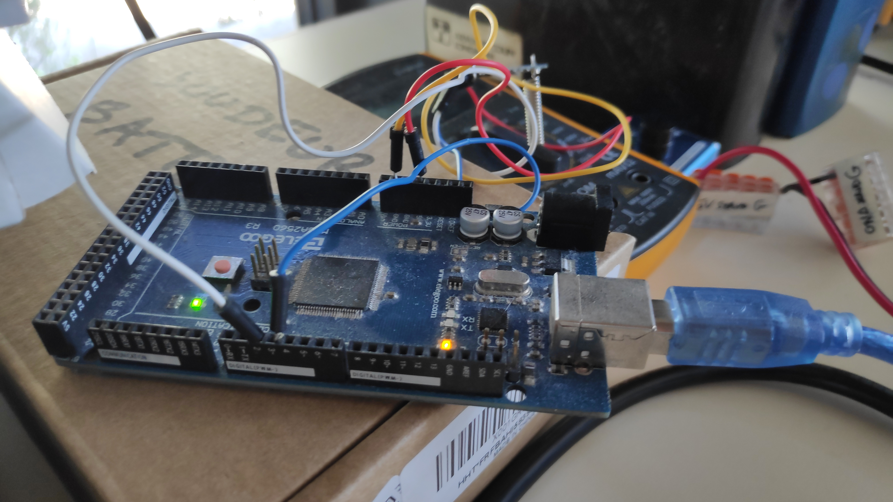
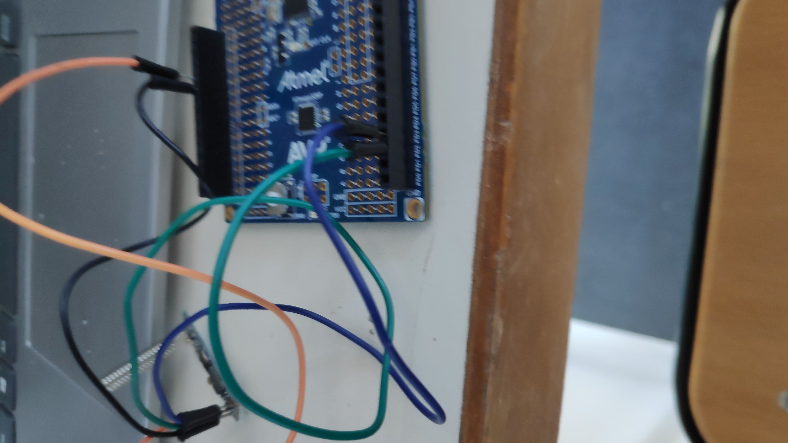
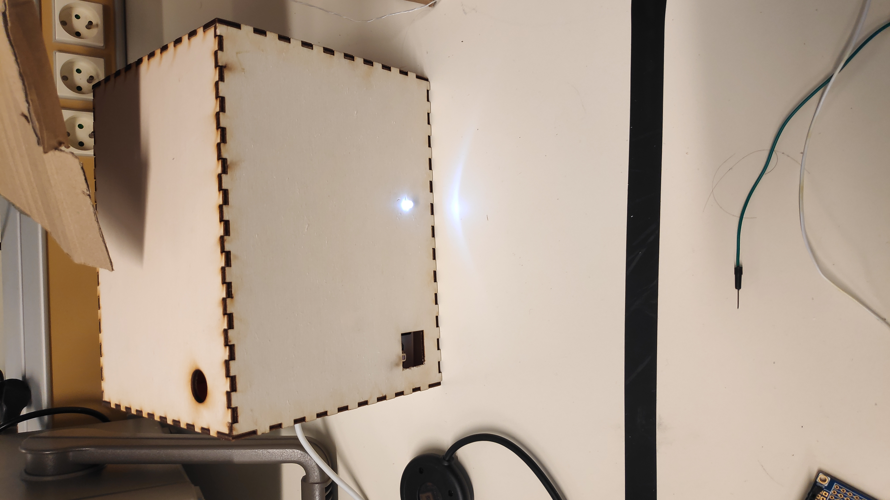
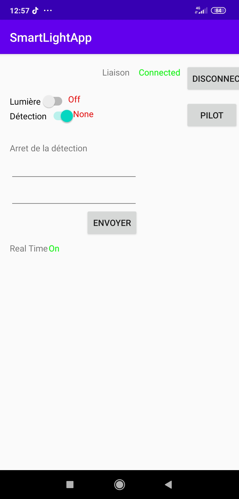

# Rapport de séance 8 du 28/02

Lors de cette séance, j'ai finalisé le montage final du boitier. J'ai ajouté les modules de communication radio et le module GPS.

## Travail éffectué à la maison

En dehors des seances, j'ai commencé à faire marcher la liaison radion entre les lampadaires. Pour ce faire j'ai utilisé deux Arduino.

Chacune possédait le même programme [ici](../../Boitiers/wireless_com/wireless_com.ino). Ce dernier permet normalement d'envoyer et de
recevoir des données à travers le module.
Sauf que comme on peut le voire sur la capture les données ne vont que dans 1 sens.

# Boitier

Lors de cette séance j'ai arrangé l'interieur de la boite afin qu'il n'y ai plus qu'une seul plaque et moins de câbles. J'ai égament percé
un trou afin de faire passer le câble pour l'alimentation. Comme on peut le voir sur l'image le boitier est entierement fermé et la lumière
est allumé par l'application bluetooth.

Sur la même application bluetooth on peut voir au niveau du RealTime qu'il est ON, cela veut dire qu'il a détecté un mouvement.

# Module Radio

Lors de cette séance, j'ai essayé de résoudre les problèmes du module radio, mentionné plus haut. Malheuresement, apres des changements
de cartes, de câble et de soudure, le problème reste inchangé. Un module HC-12 sur les 3 dont je dispose répond aux commandes AT.
Il faut que je détermine si,cela a un rapport avec mon problème.

# GPS

Le Compass qui est en liaison I2C refuse de ce calibrer ce qui pose problème pour le dirigeable. De même le GPS pose
des soucis de liaisons sérials. Il ne la détecte plus. Je n'ai pas eu le temps de vérifier les câbles. (Les test sur 
les modules radio ont pris beaucoup de temps).